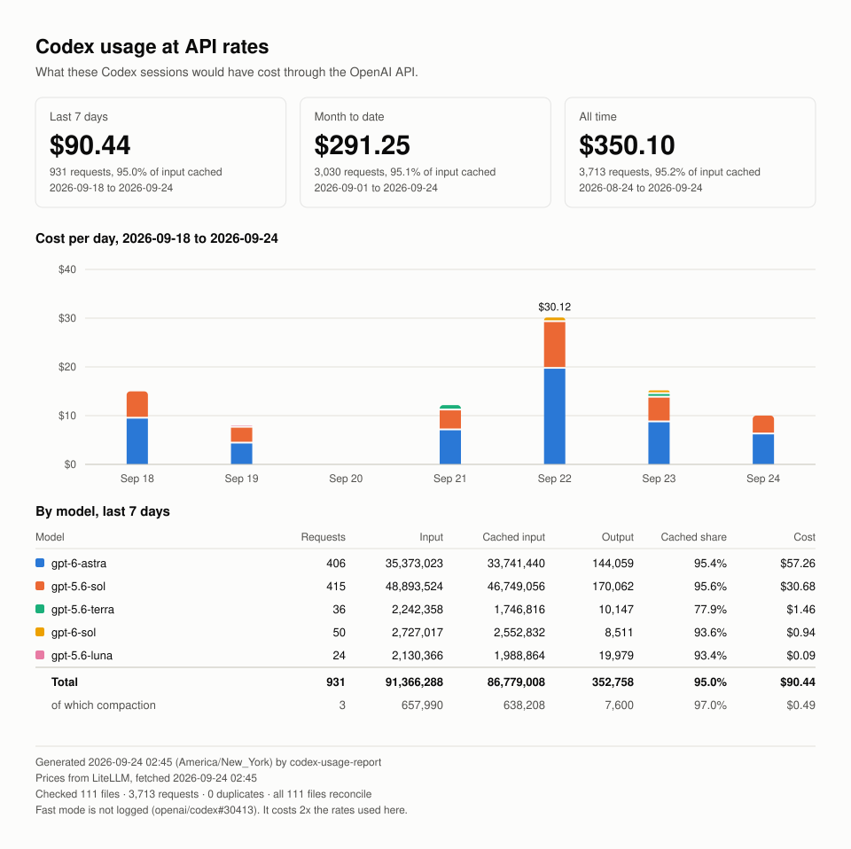

# codex-usage-report

What would your Codex usage have cost at API rates?

```bash
npx codex-usage-report
```

It reads your local Codex session logs, adds up the tokens, and prices them against public
OpenAI API rates. It writes a Markdown report and an SVG you can share. Nothing leaves your
machine except one request for the price table.



```
codex-usage-report · last 7 days · America/New_York

model           reqs        input       cached    output   cached     cost
──────────────────────────────────────────────────────────────────────────
gpt-6-astra      406   35,373,023   33,741,440   144,059    95.4%   $57.26
gpt-5.6-sol      415   48,893,524   46,749,056   170,062    95.6%   $30.68
gpt-5.6-terra     36    2,242,358    1,746,816    10,147    77.9%    $1.46
gpt-6-sol         50    2,727,017    2,552,832     8,511    93.6%    $0.94
gpt-5.6-luna      24    2,130,366    1,988,864    19,979    93.4%    $0.09
──────────────────────────────────────────────────────────────────────────
total            931   91,366,288   86,779,008   352,758    95.0%   $90.44
  compaction       3      657,990      638,208     7,600    97.0%    $0.49

month to date  $291.25      all time  $350.10

codex plan: plus · 5h window 65% used · weekly window 59% used
  as of 2026-09-24 02:40

prices from LiteLLM, fetched 2026-09-24 02:45
checked 111 files · 3,713 requests · 0 duplicates · all 111 files reconcile
Fast mode is not logged (openai/codex#30413). It costs 2x the rates used here.

wrote codex-usage.md and codex-usage.svg
```

## What it does

It reads `~/.codex/sessions/` and `~/.codex/archived_sessions/`, or the same two directories
under `CODEX_HOME` if you set it, which is where Codex writes them. It counts per-request token
usage. It reports a rolling window, month to date, and all time, and it shows your Codex rate-limit
windows as Codex last logged them, or says a window has reset since. It writes `codex-usage.md`
and `codex-usage.svg` to the current directory, or other names if you pass `--out`. The image
has the three period totals, a table of models, and a bar per day of the rolling window
stacked by model. When you run it in a terminal on your own machine, it opens the image. It
does not when output is piped, under `--json`, in CI, over SSH, or on Linux with no display.

## What it does not do

This is not your bill. Codex is a subscription. This number is what the same tokens would have
cost through the API, which is a different thing.

It does not count usage from Codex 0.152 and earlier. Those versions log token usage only as a
running total per thread. This tool counts the per-request usage records that Codex writes from
0.153.0 on, which OpenAI released on 2026-09-03. A thread started on an older version and
resumed on a newer one counts from the upgrade on. When the logs hold usage the tool cannot
count, the report prints a warning with the number of files.

It never reads or transmits anything you typed. It skips conversation content and reads only
token counters. It never modifies anything under `~/.codex`.

## Usage

```
npx codex-usage-report [options]

  --out PREFIX    output prefix          (default: codex-usage)
  --days N        window, 1 to 365 days  (default: 7)
  --json          full aggregate to stdout, suppresses the table
  --offline       never touch the network, use bundled prices
  --help          this message
```

With `--json`, warnings and the names of the written files go to stderr, so stdout holds only
the JSON. The timezone comes from your system. It needs Node 22 or newer and has no dependencies.

## What this sends over the network

It makes one unauthenticated GET request to `raw.githubusercontent.com` for the LiteLLM public
price table.

It sends no log contents, no file paths, no identifiers, and nothing about your account. The
URL is a fixed constant with nothing interpolated into it. Passing `--offline` skips the
request and uses the price table bundled with the package.

If the request fails for any reason, the report says so and names the prices it used instead.

## Accuracy

Fast mode is missing from the report. Codex requests the priority tier but the response comes
back recorded as `service_tier=default`, which is
[openai/codex#30413](https://github.com/openai/codex/issues/30413). Fast costs 2x standard
rates for every token type, so if you use it, your real API-equivalent cost is roughly double
what this shows. Every usage tracker reading these logs has the same problem.

Prices come from the LiteLLM public catalog, which mirrors OpenAI's published pricing page.
CI checks the two against each other daily. The report always names which price table it used
and when it was fetched.

Unknown models still count. A model with no published price keeps its token counts and shows
`N/A` for cost instead of being dropped.

Context compaction counts too. Codex periodically re-reads a conversation to summarise it,
which is a real request costing real money, so it appears in the totals. The line under the
total shows how much of it was compaction.

Compaction is why this report can show more tokens than ccusage or the Codex `/status` total.
Both read Codex's running total, which leaves out remote compaction, a Codex bug reported as
[openai/codex#47003](https://github.com/openai/codex/issues/47003). On the logs checked,
the difference was exactly the compaction line. On logs from Codex 0.152 and earlier
it goes the other way, since ccusage counts those and this tool does not.

Cached input is already included in the input figure. Total is input plus output.

## Alternatives

If you want a usage dashboard across Claude Code, Codex, and Copilot, use
[ccusage](https://github.com/ccusage/ccusage). This is a smaller thing. One command, one
report, one image you can paste into a thread.

## Contributing

The most useful thing you can send is data about plans other than Plus. Everything here was
verified against a single Plus account.

One question worth answering if you have a Pro or Business account: is
`model_context_window` ever above 272,000? On Plus it is capped at 258,400 for every model,
which means long-context pricing at 2x input and 1.5x output can never trigger. If a higher
plan lifts that cap, the estimate changes a lot for anyone who raises it.

[`scripts/probe.js`](scripts/probe.js) prints the shape of your Codex logs, for pasting into an
issue. It prints Codex versions, client and model names, reasoning efforts, plan and rate-limit
settings, and counts of files and requests. It prints no paths, no thread or agent names, and
nothing from a conversation. Run it from any folder:

```bash
curl -fsSLO https://raw.githubusercontent.com/SergiPantoja/codex-usage/main/scripts/probe.js
node probe.js
```

In Windows PowerShell, type `curl.exe` instead of `curl`. In a clone of this repository, run
`node scripts/probe.js`.

## License

MIT
